# Projeto GPG
# Desenvolvedores #
1- Gustavo Longon - 1966939 
2- Paulo Targa - 1977908 
3- Fellipe Augusto - 1982787 
4- Bruno Demetrio - 1958545 
5- Leonardo Caires - 1964468 

Repositório voltado para fins acadêmicos 

# Layout Eficaz #
https://www.figma.com/design/4K4fO1eAHq3Rx3jaypyPXg/LP-UNIMAR---EFICAZ?node-id=46-7989&node-type=canvas&t=6kFChxNV2IxEzyjQ-0

# Layout Dashboard #

https://www.figma.com/design/g9pQqQf8oBQP4Y0aClZTUm/Login-Gabini?node-id=0-1&node-type=canvas&t=YSnkjas02UKPjDdn-0

# Link Trello #
https://trello.com/b/S807TOPB/gpg

# Apresentacao Dashboard #

# Sistema de Gerenciamento de Usuários e Produtos

Este projeto foi desenvolvido para gerenciar usuários e produtos, garantindo uma interface funcional, amigável e segura. Abaixo estão as principais funcionalidades implementadas:

---

## 🚀 Funcionalidades

### 🔑 **Autenticação de Usuários**
- **Tela de Login e Cadastro**: 
  - Login com validação segura das credenciais.
  - Possibilidade de cadastrar um novo usuário diretamente pela interface.

    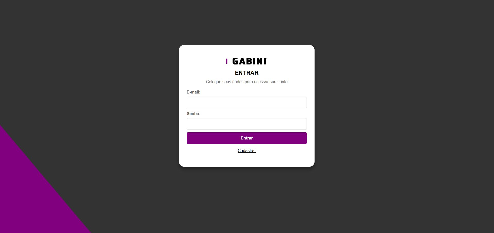 

- **Modal de Cadastro de Usuário**:
  - Modal intuitivo para cadastro de novos usuários.
  - Feedback visual (positivo ou negativo) sobre a requisição.

    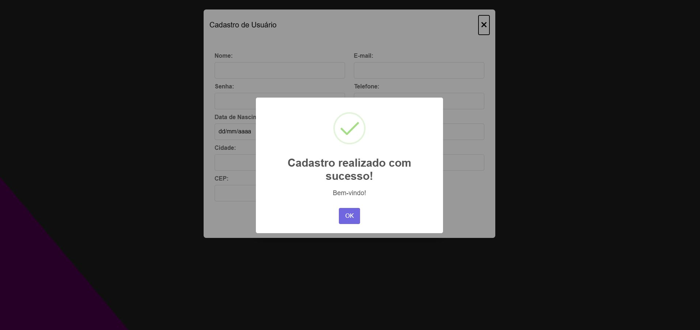 

- **Autenticação com JWT**:
  - Gerenciamento seguro de sessões utilizando tokens JWT.
  - Armazenamento do token para manter o usuário autenticado durante o uso.

    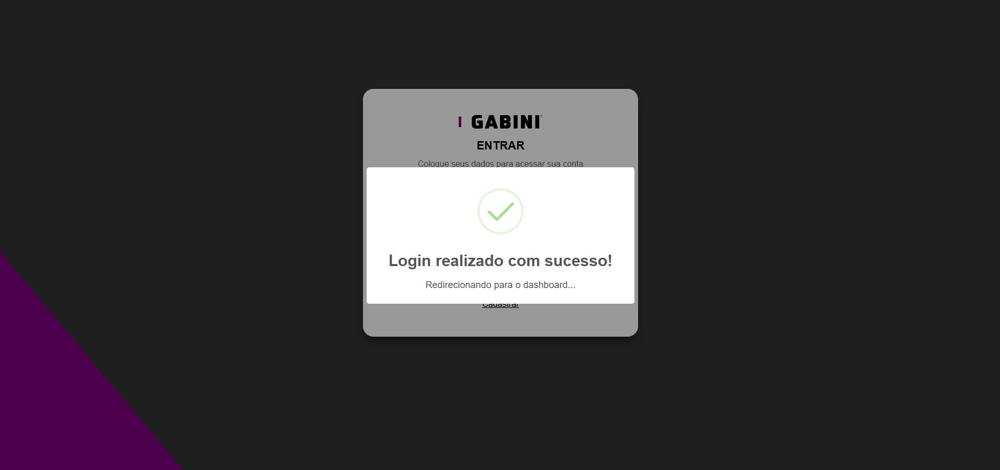 

---

### 📊 **Dashboard Inicial**
- **Visão Geral**:
  - Dois **cards de dados**:
    - **Valor Total dos Produtos**: Exibe o somatório dos valores de todos os produtos cadastrados.
    - **Número Total de Produtos**: Mostra a quantidade total de produtos no sistema.

    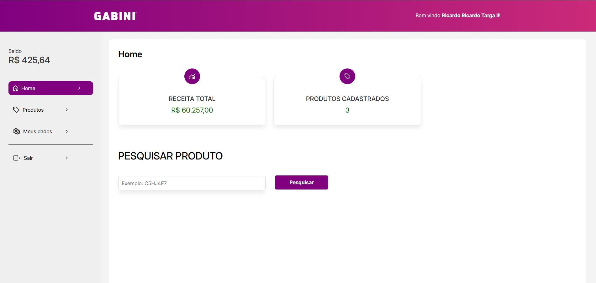 

---

### 🔎 **Funcionalidades de Produtos**
- **Campo de Pesquisa por ID**:
  - Permite buscar um produto específico pelo seu ID.
  - Retorna um **card detalhado** com informações do produto em caso de sucesso.

    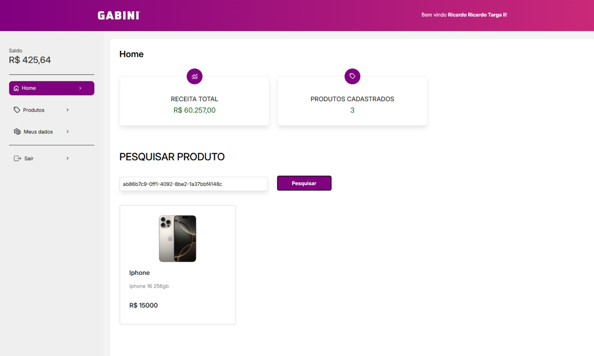 

- **Listagem de Produtos**:
  - Exibe todos os produtos cadastrados no sistema como uma lista de cards.

     

- **Modais Interativos**:
  - **Cadastro de Produto**: Modal para adicionar novos produtos ao sistema.
    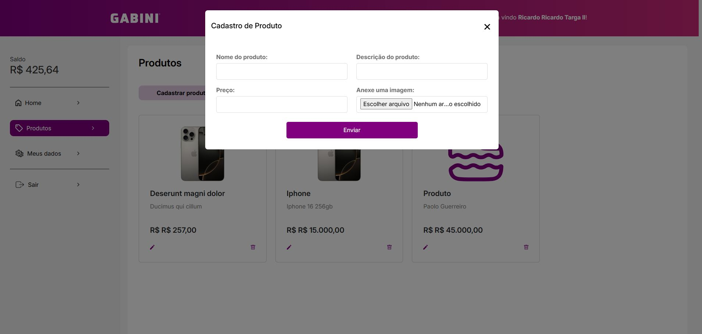 

  - **Edição de Produto**: Modal para modificar as informações de um produto existente.
    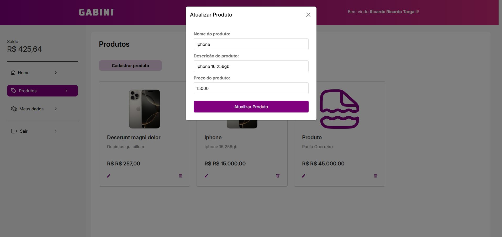 

  - **Confirmação de Exclusão**: Modal de confirmação antes de excluir um produto.
    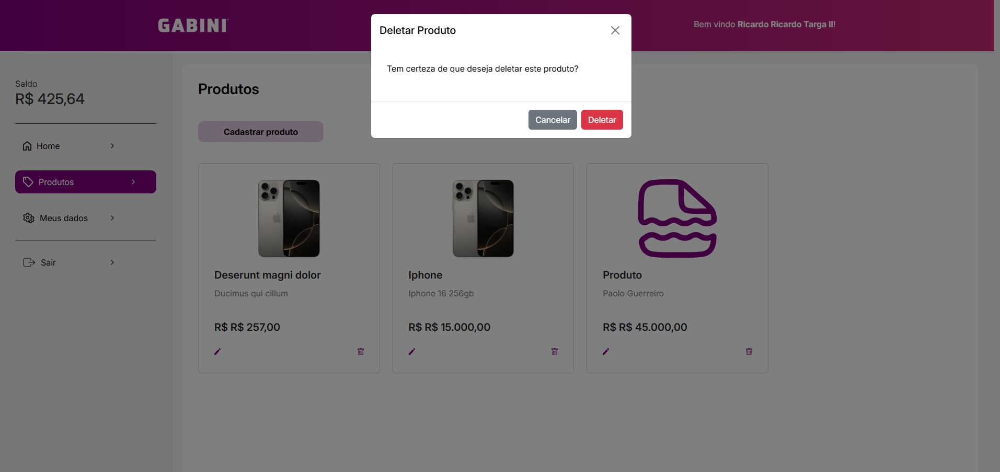 

---

### 🛠️ **Gerenciamento do Usuário**
- **Tela "Meus Dados"**:
  - Permite ao usuário alterar suas informações de cadastro, como nome, e-mail, entre outros dados.
    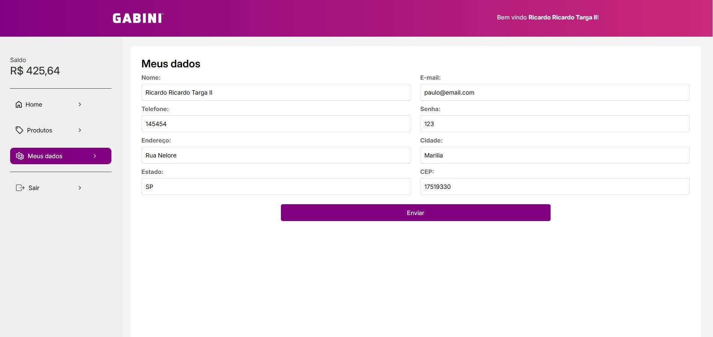 
---

### ⚙️ **Arquitetura da API**
- Design baseado em boas práticas de engenharia de software, incluindo:
  - **Encapsulamento**: Separação clara entre lógica de negócios e implementação.
  - **Interfaces**: Contratos definidos para comunicação entre camadas.
  - **Injeção de Dependências**: Facilita o desacoplamento e a testabilidade.
    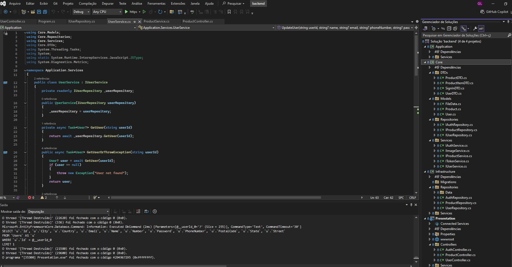 

---

## 📸 Layout e Imagens

- **Imagem da Arquitetura da API**:
  - Representação visual dos conceitos aplicados, como encapsulamento e injeção de dependências.
- **Capturas de Tela**:
  - Fotos da tela inicial implementada, conforme o layout proposto pela Eficaz.

    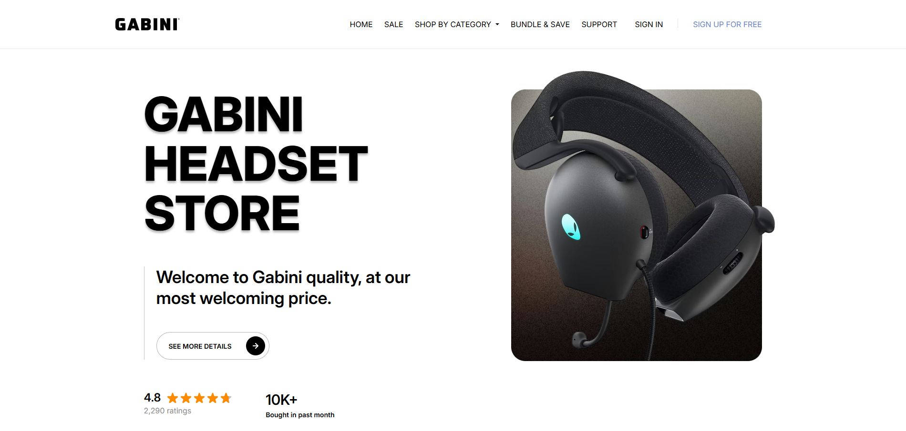
    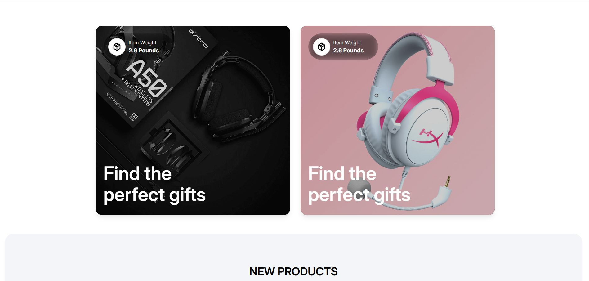
    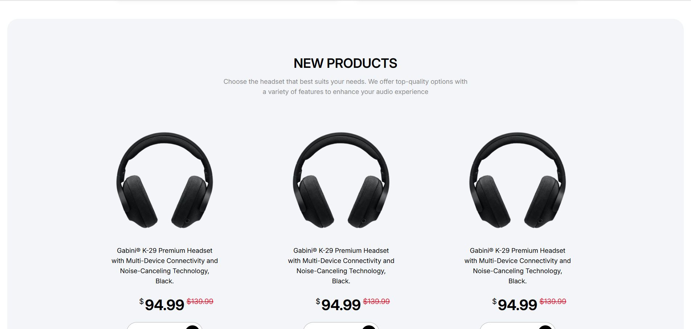
    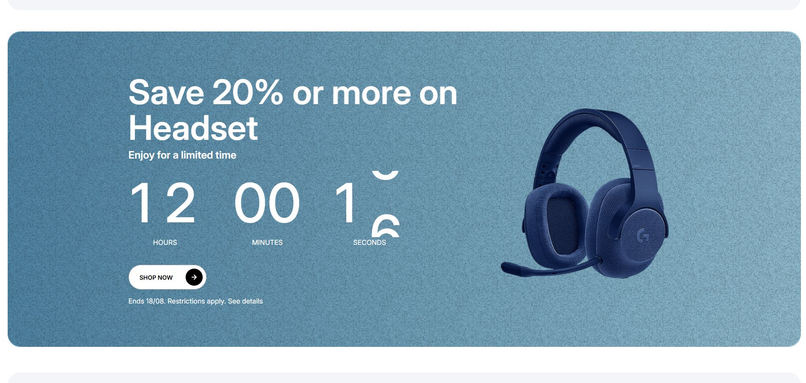
    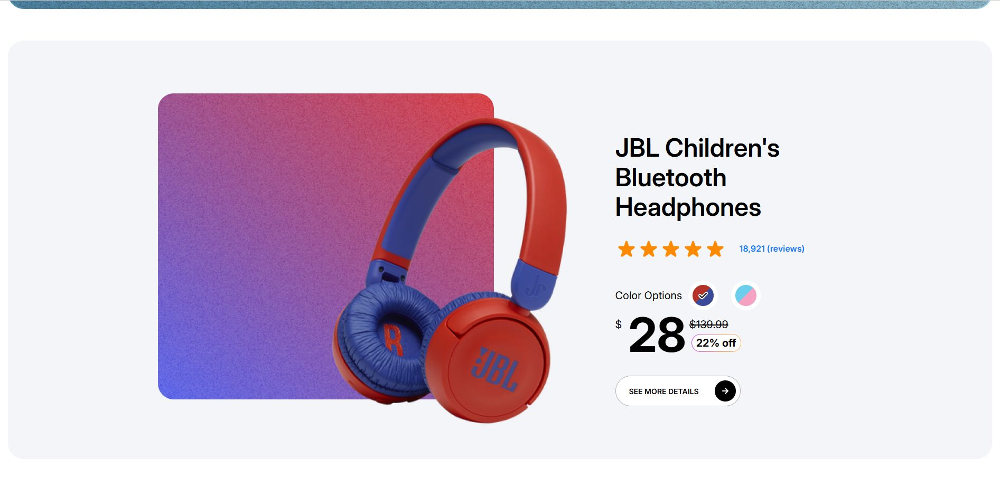
    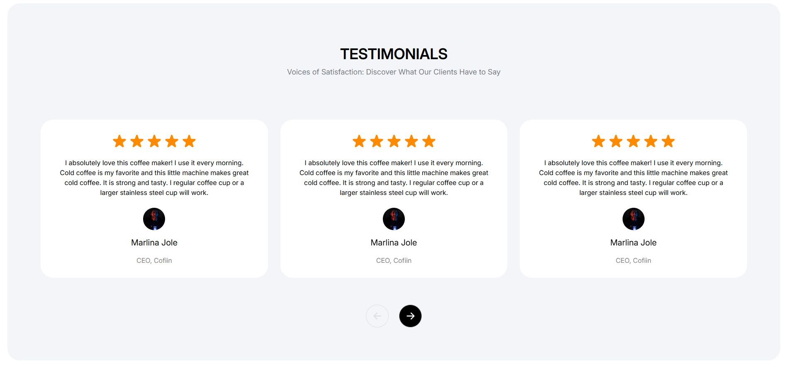

---

